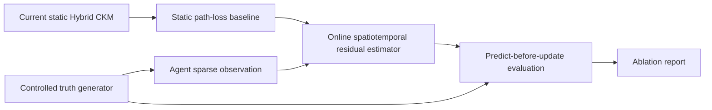

# 时空 CKM 与在线学习安全实施 Plan（Peers Review Draft）

状态：待 peers 确认
实施策略：实验优先、真值隔离、预测先于更新、主 runtime 零改动
建议名称：Physics-Informed Online Spatiotemporal CKM Residual Adaptation

## 1. Plan 结论

本方案保留真正的 CKM 时空性，但将第一阶段严格限制为独立实验：

```text
当前静态 Hybrid CKM
    + 独立受控动态信道真值
    + Agent 轨迹稀疏观测
    + 低秩时空 residual 在线估计
    + 无信息泄漏的时间/空间验证
```

第一阶段不接入 `channel.py`，不改变 `ChannelState`，不影响 scheduler、PHY、geometry、path-loss、simulation loop 或 editor。只有实验结果达到验收门槛，并由 peers 再次确认后，才讨论 shadow runtime 接入；active runtime 和闭环 QoS 不属于本 plan 的承诺范围。

推荐的在线模型不是稠密三维网格或在线 GP，而是：

> 低维空间基函数 + Gauss-Markov 时间演化 + Kalman/RLS 在线更新

它具有明确的 `(x, y, t)` 输入、空间泛化、时间演化、在线更新和预测不确定度，同时把每次 observation 的计算量控制在固定的小矩阵规模。

## 2. Peers 需要确认的决策

- [ ] 同意第一阶段仅做独立实验，不接主 runtime。
- [ ] 同意动态 ground truth 只放在 `experiments/`，不得被 CKM estimator 导入。
- [ ] 同意 observation 第一版只使用 path loss，不直接使用未经归一化的 RSRP。
- [ ] 同意采用低秩空间基函数 Kalman/RLS，而不是每网格在线 GP。
- [ ] 同意使用 predict-before-update 的 prequential 验证协议。
- [ ] 同意只评价预测误差、uncertainty、适应时间和性能开销，不宣称闭环 scheduler/QoS 提升。
- [ ] 同意未获得有效 observation 时，时空 residual 必须为零，结果退化为当前静态 CKM。
- [ ] 同意实验通过后另开 review，决定是否增加 shadow runtime adapter。

## 3. 要解决的问题

### 3.1 保证真正的时空性

同一位置在不同时间必须具有相关但不同的信道 residual：

```text
PL_truth(x, y, t)
= PL_static_ckm(x, y)
+ S_static_hidden(x, y)
+ S_temporal_hidden(x, y, t)
+ B_event(x, y, t)
+ measurement_noise
```

其中：

- `S_static_hidden`：未知的空间相关固定偏差。
- `S_temporal_hidden`：随时间相关演化的空间场。
- `B_event`：可解释的局部动态事件，例如受控遮挡出现和消失。
- `measurement_noise`：只进入 observation，不作为传播场本身。

这里使用当前静态 CKM 作为基础，是为了单独验证“时变 residual adaptation”，不声称重建完整真实 Bristol 信道。

### 3.2 避免循环学习

ground-truth generator 与 estimator 必须严格隔离：

```text
experiments/controlled_dynamic_channel.py
    生成隐藏真值，只向实验 harness 暴露 query_truth()

ran/ckm/online_spatiotemporal.py
    只接收 observation，不得导入或读取 truth generator
```

Estimator 不能访问：

- 隐藏场随机种子。
- 隐藏空间基函数。
- 隐藏长度尺度。
- 动态事件中心、半径和幅度。
- truth 的时间演化系数。

不同随机种子不是唯一隔离手段。truth 与 estimator 使用不同的空间表示，降低 matched-model/inverse-crime 风险。

### 3.3 避免时间验证泄漏

在线跟踪必须遵循：

```text
1. predict(t)
2. 与 truth(t) 比较并记分
3. observe(t)
4. 更新 estimator
```

禁止：

```text
observe(t) -> update -> predict(t) -> score same observation
```

未来预测实验则在 warm-up 结束后冻结 estimator，验证期间不再调用 `observe()`。

### 3.4 避免影响当前 RAN 闭环

当前同一个 `ChannelState` 同时进入 scheduler 和 PHY。第一阶段如果直接用预测信道替换它，将无法独立区分“scheduler 所知道的信道”和“实际执行信道”。

因此第一阶段：

- 不修改 `ChannelState`。
- 不调用主仿真 scheduler/PHY 证明 QoS 改善。
- 只将 CQI/BLER 作为由预测 path loss 推导的 secondary proxy。
- 不宣称实际吞吐、调度公平性或业务完成时间得到改善。

若以后需要闭环评估，必须另行设计：

```text
predicted channel -> scheduler
oracle channel    -> PHY execution
```

这属于跨模块 contract/flow 变更，不在当前 plan 内。

## 4. 系统边界



### 4.1 生产侧新增模块

```text
ran/ckm/online_spatiotemporal.py
```

职责：

- 内部 observation/prediction contract。
- 空间基函数。
- 时间预测。
- Kalman/RLS observation update。
- residual mean 和 uncertainty 查询。
- 配置校验和数值安全。

不负责：

- ground truth。
- Agent/simulation 生命周期。
- ChannelState。
- scheduler/PHY。
- static CKM 构建或缓存。
- 动态热力图和 UI。

### 4.2 实验侧新增模块

```text
experiments/controlled_dynamic_channel.py
experiments/ckm_spatiotemporal_ablation.py
```

truth generator 只能存在于 `experiments/`。生产 CKM 包不得导入它。

### 4.3 测试

```text
tests/test_ckm_online_spatiotemporal.py
```

第一阶段只新增以上文件，不修改任何现有 Python 文件和 JSON schema。

## 5. 独立动态 Ground Truth

### 5.1 空间表示

禁止为 Bristol 的全部 CKM cell 在每个 tick 构造稠密 GP covariance。

truth 使用独立的随机 Fourier features 或其他低秩解析基函数：

```text
S(x, y, t)
= sum_j a_j(t) * cos(omega_j_x * x + omega_j_y * y + phase_j)
```

建议：

- truth feature 数：32～64。
- 固定 seed，保证可复现。
- 至少包含两种隐藏空间尺度。
- estimator 不得读取这些 feature 参数。
- 真值查询复杂度为 O(M_truth)，不随 CKM cell 数量增长。

### 5.2 时间演化

动态系数采用按实际时间计算的 Gauss-Markov 演化：

```text
rho(delta_seconds) = exp(-delta_seconds / coherence_time_seconds)

a_j(t + delta)
= rho * a_j(t)
+ sqrt(1 - rho^2) * epsilon_j
```

使用 `elapsed_seconds = tick * tick_ms / 1000`，不能只依赖 tick 编号。改变 `tick_ms` 后，模型的物理时间尺度应保持一致。

### 5.3 受控动态事件

至少配置一个可解释事件：

```text
B_event(x, y, t)
= amplitude(t)
* exp(-distance((x, y), event_center)^2 / (2 * radius^2))
```

推荐事件阶段：

```text
pre-event   : amplitude = 0
ramp-up     : 逐步增加
active      : 保持最大损耗
recovery    : 逐步下降到 0
```

事件参数对 estimator 隐藏，并在报告中标注为 `controlled simulation event`。

### 5.4 Lazy query

truth 只在以下位置求值：

- measurement Agent 当前坐标。
- probe Agent 当前坐标。
- 空间 hold-out probe 点。
- 少量可视化 snapshot tick。

不保存完整 `(cell, tick)` 三维数组，不为每个 tick 生成全图热力图。

## 6. Observation Contract

该 contract 仅属于 `ran/ckm/online_spatiotemporal.py`，不加入 `ran/contracts/`：

```python
@dataclass(frozen=True, slots=True)
class CkmObservation:
    observation_id: str
    elapsed_seconds: float
    scene_id: str
    gnb_id: str
    carrier_freq_mhz: float
    x_map: float
    y_map: float
    baseline_path_loss_db: float
    observed_path_loss_db: float
    source: str = "controlled_oracle"
    quality: float = 1.0
```

约束：

- `observed_path_loss_db` 必须是传播 path loss。
- 第一版不接收未经归一化的 RSRP。
- `quality` 必须位于 `(0, 1]`。
- 同一 estimator instance 只服务一个 `(scene_id, gnb_id, carrier_freq_mhz)` key。
- observation 时间必须单调不回退。
- 非有限数、错误 key、重复 ID 或时间回退必须被拒绝且不改变模型状态。

学习目标：

```text
z_observed
= observed_path_loss_db
- baseline_path_loss_db
```

## 7. 在线时空 Estimator

### 7.1 低秩空间基函数

Estimator 使用与 truth 不同的固定 RBF basis：

```text
phi(x, y) = [phi_1(x, y), ..., phi_K(x, y)]

residual_estimated(x, y, t)
= phi(x, y)^T * theta(t)
```

建议：

- `K = 16～36`。
- basis center 使用 scene/map bounds 上的规则粗网格。
- basis width 为 center 间距的 1～2 倍。
- basis 输入使用 map coordinates，不在本模块维护 coordinate calibration。

这比“同一 observation 直接更新多个独立 cell”更安全：空间传播由共享 basis coefficient 自然完成，不会人为重复计算同一证据。

### 7.2 时间预测

状态：

```text
theta(t)       : K 维 residual coefficient
P(t)           : K x K covariance
last_update_s  : 最近 observation 时间
count          : 已接收 observation 数
```

预测：

```text
F = exp(-delta_seconds / model_time_constant_seconds)

theta_pred = F * theta
P_pred = F^2 * P + Q(delta_seconds)
```

必须满足：

- residual mean 在无新数据时逐渐回到 0。
- uncertainty 在无新数据时增加到 prior 水平。
- `predict_at()` 不修改内部状态。
- `observe()` 才将状态推进到 observation 时间并提交更新。

### 7.3 Kalman/RLS 更新

```text
H = phi(x_observation, y_observation)
R = measurement_noise_variance / quality

innovation = z_observed - H * theta_pred
S = H * P_pred * H^T + R
K_gain = P_pred * H^T / S

theta_new = theta_pred + K_gain * innovation
P_new = JosephForm(P_pred, K_gain, H, R)
```

使用 Joseph form 或等价的数值稳定更新，确保 covariance 对称且非负。

### 7.4 Prediction

```python
@dataclass(frozen=True, slots=True)
class SpatiotemporalCkmPrediction:
    residual_mean_db: float
    residual_std_db: float
    observation_count: int
    elapsed_since_update_s: float | None
    accepted: bool
    fallback_reason: str | None = None
```

总 path loss 由实验 harness 组合：

```text
PL_estimated
= PL_static_ckm
+ clipped(residual_mean_db)
```

安全规则：

- `observation_count == 0` 时 residual 必须为 0。
- prediction 非有限或 std 超限时拒绝 residual，使用静态 CKM。
- residual correction 使用可配置限幅，例如 ±15 dB。
- estimator 异常不影响静态 CKM baseline。

## 8. 实验数据流

每个 tick 的在线跟踪顺序：

```text
1. 更新 Agent 位置
2. truth generator 推进到 elapsed_seconds
3. 对 measurement/probe/hold-out 位置取得 truth
4. estimator 在 observe 前执行 predict_at()
5. 记录预测误差和 uncertainty
6. 只为 measurement Agent 创建 observation
7. estimator.observe()
8. 进入下一 tick
```

Probe Agent 和 hold-out 点永远不产生 observation，避免空间泄漏。

## 9. 三类验证协议

### 9.1 Online tracking

整个时间段持续 observation，但所有评分发生在当前 observation 更新之前。

回答的问题：

> 模型能否利用过去观测跟踪当前动态场？

### 9.2 Frozen future forecasting

```text
warm-up: tick 0～T_train，允许 observe
forecast: T_train+1～T_end，禁止 observe
```

分别报告 1、5、10、20 个 tick horizon 的误差。

回答的问题：

> 模型在没有新观测时能否预测未来，并合理增加不确定度？

### 9.3 Spatial hold-out

选择一个固定区域或 probe Agent，整个实验期间不参与 observe，只参与评分。

回答的问题：

> 模型能否将稀疏轨迹观测推广到未观测位置？

## 10. Ablation 设计

第一版只保留三个有效基线，删除含义不清的“时空但不在线”组：

| 组 | 模型 | 说明 |
|---|---|---|
| A | Physical prior | 使用 cell 的 `physical_path_loss_db` |
| B | Static Hybrid CKM | 使用当前 `hybrid_path_loss_db` |
| C | Static CKM + online spatiotemporal residual | 本方案 |

可选 oracle lower bound 只用于展示不可达到的参考上限，不参与模型排名。

所有组使用相同：

- Agent 轨迹。
- truth seed。
- observation budget。
- 测量噪声。
- 时间和空间 hold-out。

## 11. 指标与可声称范围

### 11.1 主指标

- online prequential path-loss MAE/RMSE。
- frozen forecast RMSE versus horizon。
- spatial hold-out MAE/RMSE。
- dynamic event adaptation time。
- event recovery time。
- predictive interval empirical coverage。
- Gaussian NLL 或等价 uncertainty score。
- 单次 `observe()` 和 `predict_at()` 延迟。
- estimator 内存占用。

### 11.2 次指标

- 由预测 path loss 推导的 RSRP error。
- CQI classification accuracy。
- BLER proxy error。

次指标不等同于真实 scheduler/PHY 闭环效果。

### 11.3 可以声称

```text
在独立受控动态信道环境中，模型利用移动 Agent 的稀疏历史观测，
在线估计随空间与时间变化的信道 residual，并改善未观测位置和未来
时刻的 path-loss/CQI proxy 预测。
```

### 11.4 不能声称

- 反映真实 Bristol 校园信道。
- 经过真实路测验证。
- 学习到真实建筑材料参数。
- 改善了真实 scheduler/QoS。
- 达到实际网络部署精度。

## 12. 性能预算

建议第一版默认：

```text
truth features       <= 64
estimator features   <= 36
simulation ticks     <= 300
measurement Agents   <= 3
snapshot heatmaps    <= 4
```

验收预算：

- 单次 observation update 的中位延迟小于 5 ms。
- 单次 prediction 的中位延迟小于 1 ms。
- estimator 状态内存小于 10 MB。
- 不构造 cell-count x cell-count covariance。
- 不保存完整 `(cell, tick)` 数组。

具体阈值可由 peers 根据运行机器调整，但必须在实现前固定。

## 13. PR Plan

### PR 0：设计确认

仅确认本文档：

- 模块 ownership。
- truth/estimator 隔离。
- observation contract。
- 验证协议。
- 性能预算。
- 可声称范围。

### PR 1：独立算法与单元测试

只新增：

```text
+ ran/ckm/online_spatiotemporal.py
+ tests/test_ckm_online_spatiotemporal.py
```

不导入主 runtime，不修改现有 CKM 文件。

单元测试必须覆盖：

- 无 observation 时 residual 为零。
- 相同 seed/config 结果确定。
- prediction 不修改状态。
- predict-before-update 行为。
- 时间回退 observation 被拒绝。
- 重复 observation ID 被拒绝。
- 非有限输入被拒绝。
- 无新数据时 mean 衰减、variance 增长。
- observation 后本地 prediction error 下降。
- covariance 数值稳定。
- correction 限幅与静态 fallback。

### PR 2：独立 truth 与 ablation

只新增：

```text
+ experiments/controlled_dynamic_channel.py
+ experiments/ckm_spatiotemporal_ablation.py
+ docs/ckm_spatiotemporal_results_zh.md
```

要求：

- truth module 不被 `ran/` 导入。
- estimator 不读取 truth 隐藏参数。
- tracking、forecast、spatial hold-out 分开报告。
- 记录 seed、配置、时间单位和 observation budget。
- 报告 synthetic/controlled simulation 限制。

### PR 3：可选 shadow adapter（不在当前承诺范围）

只有 PR 2 达到验收门槛并获得新批准后才讨论。

shadow adapter 的原则：

- 只计算和记录 prediction，不改变 `ChannelState` 运行值。
- 没有独立 observation source 时不启用 online update。
- 不修改 scheduler 或 PHY。
- 不新增共享字段；debug/report 保持 CKM 内部。

### PR 4：active runtime（明确延期）

active runtime 会改变 SINR、CQI、BLER 以及 scheduler/PHY 数值，需要单独跨组评审。它不是当前创新证明的必要条件。

## 14. Merge 风险控制

第一、二个实现 PR 只新增具有唯一名称的文件：

```text
ran/ckm/online_spatiotemporal.py
tests/test_ckm_online_spatiotemporal.py
experiments/controlled_dynamic_channel.py
experiments/ckm_spatiotemporal_ablation.py
docs/ckm_spatiotemporal_results_zh.md
```

不修改高冲突文件：

```text
ran/radio/channel.py
ran/radio/channel_pipeline.py
ran/contracts/radio.py
ran/scenario.py
simulation/*
configs/ran/channel_model.json
editor/*
```

现有 MVP、静态 CKM、RAN_DISABLE_CKM 和 fallback 路径不受影响。

## 15. 验收 Gate

### Gate A：算法正确性

- [ ] truth 与 estimator 没有 import 或隐藏参数依赖。
- [ ] 所有 observation 都按 predict-before-update 评分。
- [ ] time unit 使用 seconds，而非裸 tick。
- [ ] 无 observation 时结果严格退化为 static CKM。
- [ ] 非法 observation 不改变模型状态。
- [ ] 没有稠密 GP 或三维数组。

### Gate B：时空效果

- [ ] spatial hold-out 上 C 组优于 static CKM baseline。
- [ ] dynamic event 发生后 residual 能在有限时间内适应。
- [ ] event 消失后 residual 能回到 baseline 附近。
- [ ] forecast horizon 增加时 uncertainty 合理增加。
- [ ] 预测区间 coverage 与声明置信水平基本一致。

建议的初始门槛，需 peers 确认：

```text
event-region online RMSE 相对 static CKM 改善 >= 20%
non-event-region RMSE 恶化 <= 5%
90% predictive interval empirical coverage 位于 80%～98%
```

### Gate C：稳定性

- [ ] 当前 CKM 和 RAN 测试全部通过。
- [ ] 主 runtime 输出未发生变化。
- [ ] 没有共享接口变更。
- [ ] 性能满足已确认预算。
- [ ] 受控仿真限制在报告中明确说明。

Gate A、B、C 全部通过后，才能提出 shadow runtime 设计；不能自动进入 active runtime。

## 16. 与置信度 Overlay 方案的关系

此前的 uncertainty/coverage overlay 与本方案不冲突：

- 静态 overlay 处理当前 CKM cell 的空间置信度和覆盖边界。
- 本方案估计额外的在线时变 residual mean/std。
- 第一阶段两者完全独立，避免耦合实现。
- 如未来接入 runtime，online residual 的 std 可以交给统一 overlay 做安全 gating。

建议不要在同一 PR 同时实现静态 overlay、在线 estimator 和 runtime integration。

## 17. Peers 确认模板

```text
Decision: Approved / Approved with changes / Rejected

CKM owner:
Experiment reviewer:
Channel runtime reviewer (information only for PR 1/2):

Confirmed:
- Phase 1 is experiment-only: Yes / No
- Ground truth stays outside ran/: Yes / No
- Observation uses path loss only: Yes / No
- Predict-before-update required: Yes / No
- Shared interface changes: No
- Main runtime changes in PR 1/2: No
- Scheduler/QoS improvement claim excluded: Yes / No
- Performance budget accepted: Yes / No
- Gate thresholds accepted: Yes / Modified

Requested changes:
1.
2.

Approval date:
```
