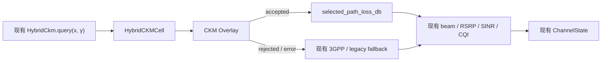

# CKM 置信度感知 Overlay 设计方案（Peers Review Draft）

状态：待 peers 确认
目标版本：CKM 增量扩展 v1
变更原则：新增优先、旧路径保留、单点接入、失败自动回退

## 1. 需要 peers 确认的结论

本方案建议只新增一个独立的 CKM 中间层：

> Uncertainty- and Coverage-Aware Physics-Informed CKM Overlay

该中间层根据 CKM 的预测不确定度和 UE 到命中网格的距离，为 CKM correction 计算可信权重。可信度高时使用 CKM 修正；可信度低或超出覆盖范围时回到物理先验或现有 3GPP/legacy fallback。

本轮不扩展多 gNB、多频点、在线学习、时空 CKM、真实测量管理平台或缓存架构。目标是在较小开发量和较低 merge 风险下，形成一个可解释、可验证的项目创新点。

请 peers 重点确认以下决策：

- [ ] 同意将“置信度与覆盖感知的物理先验融合”作为本轮 CKM 唯一创新扩展。
- [ ] 同意新增 `ran/ckm/overlay.py`，算法和内部数据结构均留在 CKM 模块内。
- [ ] 同意运行时只在 `ran/radio/channel.py` 增加一个小型可选接入点。
- [ ] 同意不修改 `ChannelState`、scheduler、PHY、geometry、path-loss 函数签名和 editor schema。
- [ ] 同意未配置 overlay 时保持当前 hard CKM 行为。
- [ ] 同意 overlay 拒绝查询或出现异常时继续使用现有 fallback。
- [ ] 确认 active 模式是否允许新增 `path_loss_formula_id` 值；如不允许，第一版只在 CKM debug/report 中记录算法版本。

## 2. 背景与当前行为

当前 Bristol 场景使用 Hybrid CKM：

```text
传播几何 + 3GPP/legacy-safe pipeline
    -> physical_path_loss_db
    -> Ridge calibration correction
    -> GP/IDW spatial residual
    -> hybrid_path_loss_db
    -> beam / RSRP / SINR / CQI / BLER
    -> ChannelState
```

当前运行时命中 CKM cell 后，直接使用：

```text
PL_runtime = PL_hybrid
```

已有 cell 同时保存：

- `physical_path_loss_db`
- `hybrid_path_loss_db`
- `prediction_std_db`
- cell 坐标与室内/室外网格类型

因此，新算法可完全复用当前 CKM 输出，不要求修改 builder、cache schema 或共享合同。

当前问题是：即使某个位置预测不确定度较高，或者查询通过最近邻命中了较远 cell，运行时仍会无条件采用完整 CKM correction。新 overlay 只解决这一问题，不承担其他 CKM 平台化工作。

## 3. 目标

### 3.1 功能目标

1. CKM correction 的使用强度随预测不确定度单调下降。
2. UE 离命中 cell 越远，CKM correction 的使用强度越低。
3. 超出允许覆盖距离时拒绝 CKM，让现有信道路径重新计算当前位置的信道。
4. 对异常 correction 限幅，降低少量错误参考点或插值异常对 RAN 的影响。
5. 保持当前 hard CKM 作为默认行为和对比基线。
6. 能通过小型 ablation 说明 physics baseline、hard CKM 和 uncertainty-aware CKM 的差异。

### 3.2 工程目标

1. 核心实现只新增在 `ran/ckm/`。
2. 运行时只有一个接入点。
3. 不改变 `estimate_channel()` 签名。
4. 不改变 `ChannelState` 字段集合、字段名称或默认值。
5. 不改变 scheduler request/response。
6. 不改变 PHY、geometry、coordinate calibration 或 3GPP path-loss 模块。
7. 所有新行为必须显式配置启用，并保留 fallback。

## 4. 非目标

本轮明确不做：

- 多 gNB 或多载波 CKM catalog。
- 在线更新、增量训练或 UE 轨迹状态。
- 三维/时空 CKM。
- 真实测量数据采集、清洗和数据库。
- CKM cache v2 或缓存迁移。
- 重构现有 `builder.py`。
- 修改 GP、Ridge、beamforming 或 3GPP 公式。
- 新增 scheduler 或 metrics 共享字段。
- 修改前端热力图数据格式。
- 将合成参考数据描述为真实测量结果。

如以上能力后续确有需要，应另开设计和 PR，不与本方案合并。

## 5. 建议架构



模块边界：

```text
ran/ckm/overlay.py
    负责：配置解析、可信权重、覆盖判断、correction 限幅、内部结果
    不负责：ChannelState、scheduler、PHY、geometry、缓存和模型训练

ran/radio/channel.py
    负责：在 CKM cell 查询后调用 overlay，并继续现有 link-budget 流程
```

## 6. 算法设计

### 6.1 输入

overlay 使用当前 cell 已存在的数据：

```text
PL_physical       = cell.physical_path_loss_db
PL_hybrid         = cell.hybrid_path_loss_db
sigma_prediction  = cell.prediction_std_db
cell_position     = (cell.x_map, cell.y_map)
query_position    = (ue_x, ue_y)
grid_spacing      = indoor_refine_scale_m 或 grid_scale_m
```

### 6.2 CKM correction

```text
delta_raw = PL_hybrid - PL_physical

delta = clip(
    delta_raw,
    -max_correction_db,
    +max_correction_db
)
```

限幅只作用于 CKM correction，不修改物理先验。

### 6.3 不确定度可信度

```text
trust_uncertainty = tau^2 / (tau^2 + sigma_prediction^2)
```

性质：

- `sigma_prediction = 0` 时，可信度为 1。
- `sigma_prediction = tau` 时，可信度为 0.5。
- 不确定度增加时，可信度单调下降。

第一版建议 `tau = 6 dB`，最终参数由 ablation 确认。

### 6.4 覆盖可信度

为避免依赖坐标标定，距离使用相对于当前网格间距的无量纲比例：

```text
distance = euclidean_distance(query_position, cell_position)
normalized_distance = distance / max(grid_spacing, epsilon)

trust_coverage = exp(-0.5 * normalized_distance^2)
```

当：

```text
normalized_distance > max_cell_distance_factor
```

overlay 返回 rejected，不使用 cell 中的物理值或 hybrid 值，由现有 pipeline 对真实 UE 位置重新计算信道。

### 6.5 最终融合

```text
trust = clamp(trust_uncertainty * trust_coverage, 0, 1)

PL_selected = PL_physical + trust * delta
```

该设计保持：

- 高可信区域接近当前 hard CKM。
- 低可信区域平滑退回物理先验。
- 覆盖范围外退回当前实时信道 pipeline。

## 7. CKM 内部接口

建议新增：

```python
# ran/ckm/overlay.py

from dataclasses import dataclass


@dataclass(frozen=True, slots=True)
class CkmOverlayConfig:
    mode: str = "hard"
    uncertainty_reference_db: float = 6.0
    max_correction_db: float = 20.0
    max_cell_distance_factor: float = 2.0


@dataclass(frozen=True, slots=True)
class CkmOverlayResult:
    accepted: bool
    selected_path_loss_db: float | None
    physical_path_loss_db: float
    raw_hybrid_path_loss_db: float
    correction_db: float
    trust_score: float
    uncertainty_trust: float
    coverage_trust: float
    normalized_cell_distance: float
    fallback_reason: str | None = None


def resolve_ckm_overlay(
    *,
    cell,
    query_x: float,
    query_y: float,
    grid_spacing: float,
    config: CkmOverlayConfig,
) -> CkmOverlayResult:
    ...
```

这些类型属于 CKM 内部接口，不加入 `ran/contracts/`。

为减少 import 和 merge 影响，第一版也不要求从 `ran/ckm/__init__.py` 统一导出；`channel.py` 可以直接从 `ran.ckm.overlay` 导入。

## 8. 配置设计

在现有 `scenes.<scene_id>.ckm` 下追加可选配置：

```json
"overlay": {
  "mode": "uncertainty_weighted",
  "uncertainty_reference_db": 6.0,
  "max_correction_db": 20.0,
  "max_cell_distance_factor": 2.0
}
```

模式定义：

| 模式 | 行为 |
|---|---|
| 未配置 | 保持当前 hard CKM 行为 |
| `hard` | 直接使用 `cell.hybrid_path_loss_db` |
| `uncertainty_weighted` | 使用本方案的置信度融合 |

第一版不修改 `CkmConfig` 或 builder。overlay 配置由 `overlay.py` 从现有 `policy.ckm_config` 的嵌套字典读取和验证，避免将运行时融合配置耦合到 CKM 构建过程。

配置无效时的建议行为：

- 明确不支持的 mode：返回 rejected，并记录 debug reason。
- 非有限数、负阈值或零网格间距：返回 rejected。
- 不抛出异常阻断仿真。

## 9. Runtime 接入

当前 `_estimate_hybrid_channel()` 查询 cell 后直接使用 `cell.hybrid_path_loss_db`。建议只在此处增加 overlay：

```python
cell = ckm.query(ue_request.position.x, ue_request.position.y)
if cell is None:
    return None

overlay_config = CkmOverlayConfig.from_dict(
    (getattr(policy, "ckm_config", None) or {}).get("overlay")
)
grid_spacing = (
    ckm.indoor_refine_scale_m
    if cell.receiver_space == "indoor"
    else ckm.grid_scale_m
)
overlay = resolve_ckm_overlay(
    cell=cell,
    query_x=ue_request.position.x,
    query_y=ue_request.position.y,
    grid_spacing=grid_spacing,
    config=overlay_config,
)
if not overlay.accepted or overlay.selected_path_loss_db is None:
    return None

path_loss_db = overlay.selected_path_loss_db
```

后续现有代码只把以下位置统一改为局部变量 `path_loss_db`：

- beam selection 的 `path_loss_db`
- `received_power`
- `ChannelState.total_path_loss_db`
- `ChannelState.evaluated_total_path_loss_db`

除此之外不调整 `_estimate_hybrid_channel()` 的返回结构和调用者。

## 10. 兼容性与接口影响

### 10.1 明确不变

- `estimate_channel(*, tick, scene, ue_request, gnb)` 签名不变。
- `HybridCkm.query(x_map, y_map)` 签名不变。
- `ChannelState` 字段不增加、不删除、不改名。
- scheduler 输入输出不变。
- PHY 输入输出不变。
- geometry 和 path-loss API 不变。
- scene/editor schema 不变。
- 旧 CKM cache 继续可读。
- 旧 heatmap 格式不变。
- `RAN_DISABLE_CKM=1` 行为不变。

### 10.2 数值影响

只有显式配置 `mode="uncertainty_weighted"` 时数值会变化：

```text
CKM path loss
  -> received power
  -> SINR
  -> CQI / BLER
  -> scheduler allocation / PHY transmission result
```

因此 active 模式虽然不改变合同形状，但会间接影响 scheduler 和 PHY 数值。启用前必须完成 shadow/ablation 对比，并通知 scheduler/metrics peers。

### 10.3 `path_loss_formula_id` 决策

推荐的科学追踪值是：

```text
hybrid_ckm_uncertainty_weighted_v1
```

但它会增加一个新的 enum-like string。为降低首个 PR 风险，建议：

1. PR 1 debug-only 阶段不修改 `ChannelState.path_loss_formula_id`。
2. active 集成前由 peers 明确确认是否接受新值。
3. 如未确认，保持现有值，并只在 CKM 内部 ablation/report 中记录 overlay mode。

## 11. Failure 与 fallback

以下情况 overlay 返回 rejected：

- cell 为空。
- path loss 或 prediction std 不是有限数。
- grid spacing 无效。
- 查询距离超过允许覆盖。
- mode 不支持。
- 配置参数无效。

接入层收到 rejected 后直接返回 `None`，复用当前 `_estimate_hybrid_channel()` 的 fallback 语义：

```text
CKM unavailable/rejected
    -> evaluate_channel_path_loss()
    -> 3GPP preferred / shadow / legacy-safe selection
```

不新增另一套 fallback，不吞掉现有 baseline。

## 12. 测试方案

### 12.1 独立单元测试

新增 `tests/test_ckm_overlay.py`：

1. `hard` 模式与当前 `hybrid_path_loss_db` 完全一致。
2. prediction std 增大时 `trust_uncertainty` 单调下降。
3. query distance 墁大时 `trust_coverage` 单调下降。
4. query 位于 cell 中心且 std 接近 0 时，结果接近 hard CKM。
5. correction 正向和负向均正确限幅。
6. 超过最大距离时返回 rejected。
7. NaN、Infinity、非法配置返回 rejected，不抛出未处理异常。
8. 结果始终位于物理先验与限幅后 hybrid 修正之间。

### 12.2 Runtime 回归

复用或补充 channel runtime 测试：

1. 未配置 overlay 时输出保持不变。
2. `hard` 模式输出保持不变。
3. weighted 模式使用 overlay 结果计算 RSRP/SINR/CQI。
4. overlay rejected 时进入现有 fallback。
5. 没有 `scene.ckm` 时行为保持不变。
6. `RAN_DISABLE_CKM=1` 时 MVP 保持可运行。

### 12.3 Ablation

最小对比组：

| 组 | 模型 |
|---|---|
| A | physical/3GPP baseline |
| B | 当前 hard CKM |
| C | uncertainty-weighted CKM |

最小指标：

- held-out path-loss MAE/RMSE
- 高不确定度区域误差
- 建筑边界/网格边界处最大跳变
- out-of-coverage rejection ratio
- RSRP/SINR/CQI 差异

若仍使用合成数据，报告必须明确标注 `synthetic validation`，不得描述为实测性能。

## 13. PR 拆分

### PR 1：CKM 内部算法，debug-only

文件：

```text
+ ran/ckm/overlay.py
+ tests/test_ckm_overlay.py
```

特性：

- 不导入主 runtime。
- 不修改共享接口。
- 不改变 MVP 输出。
- 可独立评审算法和测试。

### PR 2：可选 runtime 接入

文件：

```text
~ ran/radio/channel.py
~ configs/ran/channel_model.json
~ tests/radio/test_channel_runtime_pipeline.py
```

特性：

- 只增加一个接入点。
- 未配置时保持旧行为。
- 保留 CKM hard baseline 和现有 fallback。
- active 前需要 channel、scheduler/metrics peers 知情。

### PR 3：Ablation 与说明

文件建议：

```text
+ experiments/ckm_uncertainty_overlay_ablation.py
+ docs/ckm_uncertainty_overlay_results_zh.md
```

该 PR 不改变 runtime。若时间有限，可以将其作为项目报告阶段工作，不阻塞 PR 1。

## 14. 验收条件

实现完成需满足：

- [ ] 当前 CKM、channel、scheduler 和 integration 测试全部通过。
- [ ] 未配置 overlay 时，现有 CKM 数值路径保持不变。
- [ ] `hard` 模式与当前结果一致。
- [ ] weighted 模式的 trust 对 uncertainty 和 distance 单调下降。
- [ ] out-of-coverage 查询走现有 fallback。
- [ ] 不修改任何共享 dataclass 字段。
- [ ] 不修改任何现有必选函数参数。
- [ ] 不删除或重命名现有配置键。
- [ ] 不修改旧 cache 或 heatmap schema。
- [ ] ablation 清楚区分 synthetic 与 measured 数据。
- [ ] PR summary 明确说明对 scheduler/PHY 数值的间接影响。

## 15. 回滚方案

不需要代码级回滚即可关闭新行为：

```json
"overlay": {
  "mode": "hard"
}
```

或者删除 `overlay` 配置块，即恢复当前 CKM 行为。

如果 CKM 整体需要禁用，继续使用：

```text
RAN_DISABLE_CKM=1
```

旧 baseline 始终保留。

## 16. Ownership 与评审范围

| 模块/团队 | 是否修改 | 需要的确认 |
|---|---:|---|
| CKM | 是 | 算法、配置和测试 ownership |
| Channel runtime | 小幅修改 | 接入位置和 fallback 语义 |
| 3GPP path loss | 否 | 确认 overlay 不改变其公式/API |
| Geometry/calibration | 否 | 无实现变更 |
| ChannelState/contracts | 否 | 确认不新增字段 |
| Scheduler/PHY | 否 | 知悉 active 模式会改变输入数值 |
| Metrics/report | 否 | 确认 ablation 指标足够 |
| Editor/preview | 否 | 无 schema 变更 |

## 17. Peers 最终确认模板

```text
Decision: Approved / Approved with changes / Rejected

CKM owner:
Channel runtime reviewer:
Scheduler/metrics reviewer:

Confirmed:
- Shared dataclass changes: No
- Required function signature changes: No
- Deleted/renamed fields: No
- Existing hard CKM baseline retained: Yes
- Existing 3GPP/legacy fallback retained: Yes
- Runtime activation is opt-in: Yes
- New path_loss_formula_id approved: Yes / No / Deferred

Requested changes:
1.
2.

Approval date:
```
